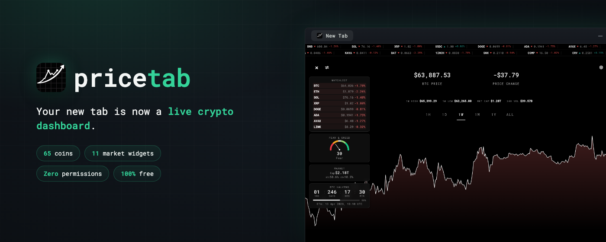

# PriceTab

[](https://chromewebstore.google.com/detail/pricetab/dobkidjmhpnniiipliollbaefpppalaf)

**Live cryptocurrency price charts on every new tab.**

A lightweight, privacy-focused Chrome extension that transforms your new tab into a real-time crypto dashboard. No accounts, no tracking, just data.

[](https://chromewebstore.google.com/detail/pricetab/dobkidjmhpnniiipliollbaefpppalaf)


---

## Features

- **Live Price Charts** - Real-time charts with smooth animations on every new tab
- **60+ Cryptocurrencies** - Bitcoin, Ethereum, Solana, and many more
- **Market Widget Panel** - 11 optional signals: Watchlist, Top Movers, Fear & Greed, Market Overview, BTC Halving, RSI, funding rate, long/short ratio, open interest, liquidations, altcoin season
- **Portfolio Tracking** - full-screen holdings view (total value + P/L); manually entered amounts, all local, no wallet connection
- **Watchlist Heatmap** - Your coins as a colour-coded grid (green up / red down)
- **Top Movers** - The day's biggest gainers and losers at a glance
- **One-Click Presets** - "Holder", "Trader" or "Minimal" widget bundles
- **Auto Rotate** - Switch to the next coin automatically at your chosen interval (10s–15m)
- **Scrolling Ticker** - Optional live price bar across the top or bottom
- **News Headlines** - Optional crypto news row in the ticker (Blockchair)
- **Live Tab Title** - Current price + 24h change right in the tab (`BTC $43,250 (+5.2%)`)
- **6 Time Periods** - 1H, 1D, 1W, 1M, 1Y, ALL
- **Dark / Light / Auto Themes** - Follows your system preference
- **37 Currencies** - USD, EUR, GBP, TRY, JPY, and more
- **Drag & Drop** - Reorder your coins and widgets
- **Privacy First** - Zero permissions, no account, all data stored locally
- **100% Free** - No ads, no premium tier, loads instantly

### Market Widgets (optional, toggleable from settings)

- **Watchlist** - Your coins as a colour-coded 24h heatmap
- **Top Movers** - The day's biggest 24h gainers and losers
- **Fear & Greed Index** - Crypto market sentiment score
- **Market Overview** - Total market cap, volume and BTC/ETH dominance
- **BTC Halving Countdown** - Days until next halving
- **RSI Widget** - Relative Strength Index for current coin
- **Funding Rate** - Perpetual futures funding rate (OKX)
- **Long/Short Ratio** - Long vs short account ratio (Bybit)
- **Open Interest** - Total open futures contracts in USD (OKX)
- **Liquidations** - 24h long/short liquidation volume (OKX)
- **Altcoin Season Index** - BTC dominance-based market phase indicator

---

## Installation

### Chrome Web Store (Recommended)

**[Install PriceTab from the Chrome Web Store](https://chromewebstore.google.com/detail/pricetab/dobkidjmhpnniiipliollbaefpppalaf)** — one click, auto-updates.

If PriceTab makes your new tab better, a rating on the store page helps others find it.

### Manual Installation (Developer Mode)

1. Download or clone this repository
2. Open Chrome and navigate to `chrome://extensions/`
3. Enable **Developer mode** (toggle in top-right)
4. Click **Load unpacked**
5. Select the extension folder
6. Open a new tab

---

## Usage

### Viewing Prices

- **Click the price** (top-left) to cycle through your coins
- **Click the change percentage** (top-right) to toggle between $ and %
- **Use time period buttons** below the chart to change timeframe

### Managing Coins

1. Click the **gear icon** (top-right) to open settings
2. **Search** for coins in the search box
3. **Click** a coin to add it to your watchlist
4. **Drag** coins to reorder
5. **Click X** on a coin to remove it

### Preferences

In the settings panel, you can customize:

- **Theme** - Dark, Light, or Auto (follows system)
- **Currency** - 37 fiat currencies available
- **Refresh Rate** - 10s, 30s, 1m, or 5m

---

## Tab Title Feature

Your browser tab shows live crypto prices - visible even when working in other tabs:

```
BTC $43,250 (+5.2%)
```

- Updates automatically every 30 seconds
- Shows current coin, price, and 24h change
- Changes when you switch coins

---

## Supported Cryptocurrencies

**Major:** BTC, ETH, BNB, SOL, XRP, DOGE, ADA, AVAX, DOT, MATIC

**DeFi:** LINK, UNI, AAVE, MKR, SNX, COMP, CRV, 1INCH, SUSHI

**Layer 2:** ARB, OP, MATIC, IMX, LRC

**And 60+ more** including SHIB, LTC, ATOM, FIL, APT, SUI, SEI, TIA, INJ, and others.

---

## Tech Stack

| Technology | Purpose |
|------------|---------|
| React 16.5 | UI Framework |
| D3.js v5 | Chart Visualization |
| styled-components | CSS-in-JS Styling |
| Coinbase API | Price Data |
| Chrome Manifest V3 | Extension Platform |

All dependencies — scripts, styles, and fonts — are bundled locally. No external CDN requests.

---

## Privacy

PriceTab is designed with privacy as a core principle:

- **No account required** - Use immediately after install
- **No data collection** - We don't track anything
- **No analytics** - No Google Analytics, no telemetry
- **Local storage only** - Your coin list stays on your device
- **No third-party sharing** - Your data is yours
- **Public API only** - No authentication tokens stored

Network requests are made only to:
- Coinbase Public API (price charts and spot prices)
- Alternative.me (Fear & Greed Index)
- OKX Public API (funding rate, open interest, liquidations)
- Bybit Public API (long/short ratio)
- Coinlore Public API (market overview, altcoin season / BTC dominance)
- mempool.space (BTC halving block height)
- Blockchair Public API (crypto news headlines, optional ticker row)

All of these are public APIs requiring no authentication or account.

---

## Development

### Prerequisites

- Chrome browser
- Text editor

### Quick Start

```bash
# Clone the repository
git clone https://github.com/Zekuath/Pricetab.git

# Load in Chrome
1. Go to chrome://extensions/
2. Enable Developer mode
3. Click "Load unpacked"
4. Select the project folder
```

### Project Structure

```
pricetab/
├── src/
│   ├── app.js          # Main application (~7,700 lines)
│   ├── theme-init.js   # Prevents white flash on load
│   └── rate.js         # Toolbar popup script (opens store listing)
├── vendor/             # Bundled dependencies
├── assets/icons/       # Extension icons
├── docs/               # Documentation
├── site/               # Promo website (GitHub Pages, not shipped)
├── manifest.json       # Chrome extension config
├── index.html          # Entry point (new tab page)
├── rate.html           # Toolbar icon popup
└── privacy.html        # Privacy policy (GitHub Pages)
```

### Making Changes

1. Edit files in `src/`
2. Go to `chrome://extensions/`
3. Click reload icon on PriceTab
4. Open new tab to test

No build process required - changes are immediate after extension reload.

---

## Documentation

| Document | Description |
|----------|-------------|
| [VISION.md](docs/VISION.md) | Feature roadmap and future plans |
| [TODO.md](docs/TODO.md) | Development tasks and progress |
| [CHANGELOG.md](docs/CHANGELOG.md) | Version history |
| [PRIVACY.md](docs/PRIVACY.md) | Privacy policy |
| [STORE_DESCRIPTION.md](docs/STORE_DESCRIPTION.md) | Chrome Web Store listing content |
| [STORE_ASSETS.md](docs/STORE_ASSETS.md) | Chrome Web Store asset guide |
| [policies/](docs/policies/) | Chrome Web Store policy compliance |

---

## Contributing

Contributions are welcome! Please read the documentation in `docs/` before submitting PRs.

1. Fork the repository
2. Create a feature branch (`git checkout -b feature/amazing-feature`)
3. Commit your changes (`git commit -m 'Add amazing feature'`)
4. Push to the branch (`git push origin feature/amazing-feature`)
5. Open a Pull Request

---

## License

This project is licensed under the MIT License - see the [LICENSE](LICENSE) file for details.

### Acknowledgments

This project is based on work by [halvves](https://codepen.io/halvves/pen/JmgbVV). See LICENSE for full attribution.

---

## Support

- **Website:** [zekuath.github.io/Pricetab/site](https://zekuath.github.io/Pricetab/site/)
- **Issues:** [GitHub Issues](https://github.com/Zekuath/Pricetab/issues)
- **Discussions:** [GitHub Discussions](https://github.com/Zekuath/Pricetab/discussions)

---

**Made with care for the crypto community.**
