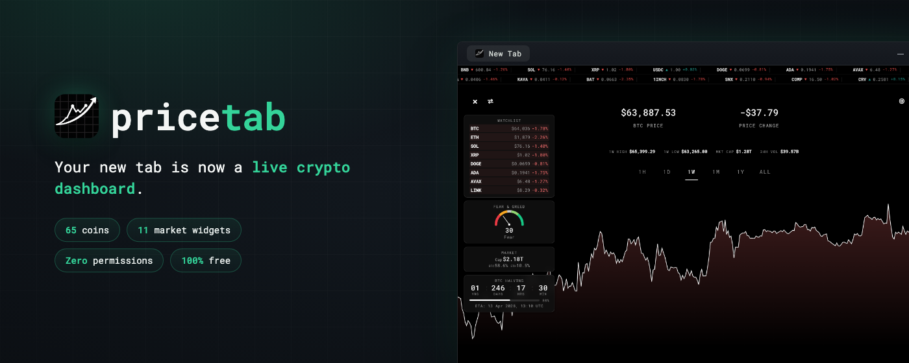

# PriceTab

[](https://chromewebstore.google.com/detail/pricetab/dobkidjmhpnniiipliollbaefpppalaf)

**Live cryptocurrency price charts on every new tab.**

A lightweight, privacy-focused Chrome extension that turns your new tab into a
real-time crypto dashboard. No account, no tracking, **zero permissions at
install**.

[](https://chromewebstore.google.com/detail/pricetab/dobkidjmhpnniiipliollbaefpppalaf)


---

## The chart

- **A live chart on every new tab** — line or candlestick, six ranges from the
  last hour to all time
- **Crosshair readout** — hover for that point's open, high, low, close and
  volume; candles are fetched only once you actually hover
- **Compare two coins** — both drawn as percent change from the start of the
  range, on one shared axis. Never a second y-axis: two price scales on one
  chart put the crossing point wherever the scales were placed rather than
  where the market put it
- **Market stats** — the range's high and low, market cap, 24h volume and VWAP
- **Optional grid** — price levels and time divisions read off the range on
  screen. Hover a cell to light it up
- **A logarithmic axis** (<kbd>Y</kbd>) for the ranges that need one, and
  **an average line** that says how long it averages — a sixth of what is on
  screen, never a day count, because a point is half a minute on one range and
  a fortnight on another
- **"What happened here?"** — marks at the moves that were unusual *for this
  coin*, and the headlines from around them. It never says why, only what was
  being written at the time
- **A chart companion** — head and shoulders, double tops and bottoms and
  twelve common strategy setups, named where they appear on the chart, each
  with what followed its past appearances on this coin. It never scores them
  and never says which is better: tested together, none of the setups'
  differences from the plain base rate held up
- **Indicator lines** — Bollinger and Donchian bands, the 50- and 200-day
  averages and Supertrend, any number at once, each labelled as daily
- **US CPI releases** marked where they fall, with a note under the price in
  the hours around the next one
- **Since your last visit** — how the coin moved since you last looked
- **Save as image** (<kbd>I</kbd>) — the chart as a PNG, drawn on the device
- **Live tab title** — `BTC $43,250 (+5.2%)`, visible while you work elsewhere

## Calls — say where the price goes, and keep the score

Switch them on with <kbd>L</kbd> and the right-hand side of the chart becomes a
**board**: real price bands at real moments in the future, drawn as squares you
can point at.

- **Two clicks to commit** — the first drafts the square, the second locks it.
  One stray click should not put a prediction on a record
- **It settles itself**, the next time you open a tab, against the price at the
  moment that was called — not against hours of drift afterwards
- **The board is a fixed lattice, not a fitted scale** — one square stays
  fifteen minutes and $100 while you are on that range, so a box you locked
  yesterday is still on the gridlines it was drawn on
- **Several calls can share a column, and they are not equal.** The first is
  the claim; the rest are hedges around it, and only the first is marked
- **Drag the "now" line** to trade history for board; **a band** shows how far
  this coin usually travels over each square's worth of clock
- **A win is celebrated on the box that came true.** Its own key
  (<kbd>K</kbd>), its own control in the corner, and a mark on that control
  when something has settled since you last looked

Calls keep running with the feature switched off, but nothing is drawn and
nothing is announced while it is off.

**The score is local, valueless and never sent.** A score that could become
something purchasable would turn a price chart into a wager on an asset, which
the Chrome Web Store bans outright and which is not what this is for.

## Price targets

- **"BTC rises above 80,000"** or **"BTC falls 5% in 1h / 4h / 24h"**
- Reported the next time you open a tab — including targets hit **overnight**,
  because detection searches the last week of candles rather than only the
  price right now
- Announced in the tab title, and — **only if you switch it on** — as a Chrome
  notification with a sound. The `notifications` permission is optional, asked
  for from the switch itself, and the row says the one honest limit: there is
  no background worker, so it fires while a PriceTab tab is open

## A derivatives market, with no money in it

Press <kbd>F</kbd> for a trading terminal: a perpetual contract priced from a
real venue's public quotes, long or short at 1–200x, stops, take-profits,
trailing stops, limit, stop and scaled orders, funding and liquidation —
settled in **Practice Units**, which exist only on this device and cannot be
bought, sold or cashed out. The page says *Simulated · no real money*
permanently, and shows a terms screen once before it draws anything.

- **Laid out like a venue's screen** — the chart, the order book and the
  ticket side by side, positions underneath; drag the seams between them (or
  use the arrow keys) and the layout is kept
- **Candles with volume** from the contract itself, with the open, high, low
  and close under the cursor; click a price on the chart or in the book and
  the ticket is set to a limit there
- **Orders that carry their own stop and take-profit**, scaled orders spread
  across a range (placed together or not at all), and a history of how each
  order ended

- **Marked on the mark, traded at the last** — liquidation reads a median of
  the last three ticks, the way a venue marks on an index rather than on one
  bad print; fills read the last price
- **A venue's size ladder** caps leverage by contract size; switching it off is
  labelled as non-venue behaviour and stamped on the contract for its whole
  life
- **The ledger explains the balance exactly** — every Practice Unit that moves
  is an event, and the test suite refuses a ledger that does not add up
- **An assistant that reports and never advises** — the stop against the
  window's ordinary steps, the loss at the stop against the plan, as counts
  with their denominators. **An outlook** replays the window's own steps two
  thousand times and prints where they landed. **A crowd reading** leans only
  when its own record on the market says it should — measured the day it was
  built, four of five coins read "no lean"
- **The order book**, live from the venue, filterable by side, step and size
- **The record grades the process, not the money**

## Portfolio

- **Track holdings by amount** — or paste a public address and let it read the
  balance (BTC, ETH, LTC, DOGE, BCH, ZEC, plus 55 ERC-20 tokens read from their
  contracts, never matched by symbol). Read-only, no wallet connection
- **More coins can be held than charted** — the 81 the chart draws plus 32
  priced from a sweep the app already makes
- **Purchases, sales and income, each with a date** — cost basis,
  unrealized and realized P/L, matched by FIFO, LIFO or HIFO, with the method
  stamped on each sale as it is recorded
- **Charts of one series** — total, by coin, P/L, **as held** (what you
  actually held on each day, against the money paid in) and **mix** (each
  coin's share over time); **what each holding contributed**; **"Return
  p.a."**, the money-weighted figure your bank prints; the worst fall;
  **vs BTC**
- **The ledger** — one holding in detail, every record in order, and the
  **time-weighted return month by month**, with the money you moved in and
  out taken out of it
- **Target shares** — how far each holding has drifted from the share you
  want, in points, money and coins. A number, never an arrow
- **A watched address is checked against the OFAC sanctions list on this
  device** — the list is bundled precisely so the address never leaves the
  machine
- **Press <kbd>H</kbd>** and the figures are masked with a fixed `•••` — this
  is the new tab page, and someone may be leaning over the desk
- **Cost basis report (CSV)** — the record a tax return is worked out from,
  not the return itself. **Everything PriceTab knows** can also be saved to
  one file and read back, or merged

## Crypto tax guide — every country, official sources only

A **Tax guide** button on the portfolio opens the crypto tax rules of all 244
countries and territories: what is taxed and what is not (buying, holding,
moving between your own wallets, selling, swapping, spending, staking,
mining, airdrops), the tax year, the rates and reliefs. **Every rule comes
from the country's own tax authority, law, parliament, ministry or central
bank**, linked, with the day it was read — never a news site, a firm or a
guide. Where no official source could be confirmed, the card says so and
states nothing.

Where the rule is specific enough, your recorded sales and income are matched
the way that country does it, with an estimate at the rate you enter and a
file to download (Form 8949's columns in the US). It is **not tax advice**,
and it says so before anything else.

## News

- **A panel (<kbd>N</kbd>) that dates everything and can be narrowed** — by
  source, by the coins you track or hold, by a search that matches what is on
  screen
- **Five sources need no permission** — Hacker News, CNBC's crypto section,
  MarketWatch, Bitcoin.com and CryptoPotato. Eight more newsrooms —
  CoinDesk, The Block, Cointelegraph, Decrypt, CryptoSlate, Bitcoin Magazine,
  CoinJournal, BBC Business — sit behind an **optional host permission**,
  asked for **once** from the panel and otherwise managed in Settings →
  Permissions, one newsroom at a time
- **An exchange's notices, if you want them** — Bybit's delisting and
  network-upgrade notices, off until you switch them on; its listings,
  campaigns and giveaways never reach the panel
- **By day, or by coverage** — a heading for each day, or the stories the
  most newsrooms ran first; headlines you have opened are dimmed
- **A reading room** from 1100px: the feed, and beside it what it adds up to —
  how many stories are worded up or down, your coins with counts, every
  source with when it last spoke
- **Worded up / worded down** on every row — a count of the words in the
  headline, done on your device with no AI service, with the words it counted
  in the tooltip. It says how a story is worded, never what happened
- **Advertising is kept out**, four newsrooms writing up one event are one
  row, and a section says when the coin on your chart has just moved unusually

## Base rates — "has this happened before?"

Press <kbd>B</kbd>: what followed every past time this coin's daily closes
entered the state they are in now — RSI levels, fifteen candlestick shapes,
chart patterns, twelve strategy setups, and the last twelve US CPI releases.
Episodes, not days; every figure carries its `n`; below twelve episodes the
panel prints the counts and refuses the comparison. What got built instead of
buy and sell signals.

## Market widgets — all optional, all off by default

Watchlist · Top Movers · Fear & Greed · Market Overview · BTC Halving
Countdown · Difficulty · ETH Gas · BTC Fees · Mempool · RSI · Outlook ·
Regimes · Worst Fall · Funding Rate · Long/Short Ratio · Open Interest ·
Liquidations · Altcoin Season

One-click **Holder / Trader / Minimal** bundles, drag to reorder, four sizes
from compact to extra large, and a drawer you can widen.

## Everything else

- **81 coins**, searchable by name or symbol; **37 display currencies**
- **Thirteen languages**, following the browser by default
- **Dark / light / auto** themes, following your system by default
- **Minimal / Fast / Trader / Holder** modes, plus a Custom slot that keeps
  the arrangement you built
- **Auto-rotate** through your coins, 10 seconds to 15 minutes
- **Scrolling ticker** across the top or bottom, with an optional news row
- **The toolbar button** prints your coins' prices from the cache it already
  has — it makes no request of its own
- **Keyboard-first** — see below
- **No ads, no account, no tracking**

---

## Keyboard shortcuts

Press <kbd>?</kbd> in a new tab for this list.

| | |
|---|---|
| <kbd>←</kbd> <kbd>→</kbd> | Previous / next coin |
| <kbd>1</kbd>–<kbd>6</kbd> | Switch range, 1H through ALL |
| <kbd>/</kbd> | Jump to a coin by name |
| <kbd>R</kbd> | Refresh now |
| <kbd>T</kbd> | Line / candlestick chart |
| <kbd>G</kbd> | Price / time grid on the chart |
| <kbd>L</kbd> | Calls on / off |
| <kbd>[</kbd> <kbd>]</kbd> | Board reach: zoom out / in (with calls on) |
| <kbd>X</kbd> | Percent / price change |
| <kbd>Y</kbd> | Log / plain price axis |
| <kbd>I</kbd> | Save the chart as an image |
| <kbd>D</kbd> | Dark / light theme |
| <kbd>Space</kbd> | Auto-rotate coins on / off |
| <kbd>W</kbd> | Widgets |
| <kbd>V</kbd> | The chart's settings, beside the chart |
| <kbd>A</kbd> | Price targets |
| <kbd>K</kbd> | Calls — the board and the record |
| <kbd>C</kbd> | Compare with a second coin |
| <kbd>,</kbd> <kbd>.</kbd> | Pull out the left / right column of tabs |
| <kbd>S</kbd> | Settings (<kbd>1</kbd>–<kbd>9</kbd>, <kbd>0</kbd> walk its menu) |
| <kbd>P</kbd> | Portfolio (<kbd>H</kbd> hides your amounts) |
| <kbd>F</kbd> | Derivatives market |
| <kbd>N</kbd> | News |
| <kbd>B</kbd> | Base rates |
| <kbd>?</kbd> | These shortcuts |
| <kbd>Esc</kbd> | Close whatever is open |

On the derivatives page: <kbd>B</kbd> / <kbd>S</kbd> long / short,
<kbd>1</kbd>–<kbd>4</kbd> size, <kbd>Enter</kbd> the order button,
<kbd>X</kbd> close the open contract. With the chart focused,
<kbd>←</kbd> <kbd>→</kbd> read the bars and <kbd>Enter</kbd> prices a limit;
in the book <kbd>↑</kbd> <kbd>↓</kbd> walk the levels; on a seam the arrows
resize it.

---

## Install

### Chrome Web Store

**[Install PriceTab](https://chromewebstore.google.com/detail/pricetab/dobkidjmhpnniiipliollbaefpppalaf)**
— one click, auto-updates.

If PriceTab makes your new tab better, a rating helps others find it.

### From source

1. Clone or download this repository
2. Open `chrome://extensions/`
3. Enable **Developer mode**
4. **Load unpacked** → select the project folder
5. Open a new tab

### iPhone

`ios/` wraps the same page in a WKWebView with a home-screen widget; nothing
in the extension changes for it. `ios/README.md` walks through building it on
your own phone with Xcode.

### Building the upload

```bash
./scripts/package.sh
```

Writes both forms side by side — `assets/upload/pricetab-<version>/` to load
unpacked, and `assets/upload/pricetab-<version>.zip` for the dashboard. The
archive is built from an allowlist rather than by zipping the folder, and the
script checks that allowlist against what `index.html` actually loads, so a
new `src/` file nobody added to it fails the build instead of breaking the
extension for everyone on the store.

---

## Privacy

PriceTab is installed with **no permissions**. There is no account, no
analytics, no telemetry, and nothing is sent anywhere except the public APIs
below. Your coin list, settings, portfolio, targets, calls and practice
account live in your browser's local storage and never leave the device.

Two things are **optional**, off until you press a button inside the app, and
never asked for at install: a Chrome notification for a hit target or a
stopped-out contract, and host access to eight newsroom feeds.

Every request goes to a public, keyless API:

| Host | What for |
|------|----------|
| `www.coinbase.com` | Prices and chart history; exchange rates for non-USD |
| `api.exchange.coinbase.com` | Candles for the crosshair and candlestick chart |
| `api.kraken.com` | Prices for six coins Coinbase doesn't list, long-range candles, and a fallback while Coinbase is not answering |
| `api.coinlore.com` | Market overview, altcoin season, and one bulk snapshot that feeds the ticker, watchlist, top movers and price-only coins |
| `api.alternative.me` | Fear & Greed index |
| `www.okx.com` | Funding rate, open interest, liquidations; the perpetual's quotes, candles and order book while the derivatives page is open |
| `api.bybit.com` | Long/short ratio and the crowd reading; its delisting and network-upgrade notices if you switch them on |
| `mempool.space` | BTC halving, fees, mempool and difficulty cards; BTC address balances if you watch one |
| `api.blockchair.com` | ETH/LTC/DOGE/BCH/ZEC address balances if you watch one; the news archive behind "what happened here?" |
| `ethereum-rpc.publicnode.com` | ERC-20 token balances if you watch an Ethereum address |
| `hn.algolia.com`, `search.cnbc.com`, `feeds.content.dowjones.io`, `news.bitcoin.com`, `cryptopotato.com` | The five news feeds that need no permission |
| `www.coindesk.com`, `www.theblock.co`, `cointelegraph.com`, `decrypt.co`, `cryptoslate.com`, `bitcoinmagazine.com`, `coinjournal.net`, `feeds.bbci.co.uk` | The eight behind the optional host permission — never contacted until you grant it |

Address balance lookups happen **only** for addresses you explicitly add, and
the address is sent only to the balance provider for that chain. The sanctions
check happens on the device, against a bundled list.

Clicking a headline opens that news site, and a tax guide source opens that
government page — both only when you click. Nothing else leaves the browser.

Full policy: [docs/PRIVACY.md](docs/PRIVACY.md)

---

## Development

No build step. Edit a file, reload the extension, open a new tab.

```bash
git clone https://github.com/Zekuath/Pricetab.git
# chrome://extensions/ → Developer mode → Load unpacked → select the folder
```

### Tests

```bash
npm --prefix tests ci             # exact-pinned dev dependencies
npm --prefix tests run browsers   # the Chromium the render suites drive
npm --prefix tests run check      # lint + architectural rules + every suite
```

ESLint's `no-undef` is this project's compiler (it derives every cross-file
global from `src/`), `ast-grep` holds the structural rules (no React hooks, no
direct state mutation, no raw `localStorage`), and thirty-six suites run the
source in `node:vm`, in jsdom and in real Chromium with the network stubbed —
one of them walks the derivatives model at random and checks after every move
that the ledger still explains the account.
`tests/README.md` lists them. CI runs the same command on every push.

### Project structure

```
pricetab/
├── src/                    # ~89,000 lines across 62 files, loaded as
│   │                       #   ordered <script> tags sharing one global scope
│   ├── app.js              # Root component and all state; app-*.js hold its handlers
│   ├── chart.js            # D3 chart; chart-board.js its geometry, chart-axes.js its scales,
│   │                       #   chart-viewport.js its window in time, chart-tools.js its drawings
│   ├── api.js              # Fetchers, caches, providers
│   ├── portfolio*.js       # Holdings, lots, sales, the charts, the ledger
│   ├── tax-*.js            # The tax guide: every country's rules, the engine, the screen
│   ├── practice-*.js       # The derivatives account: model, page
│   ├── alerts*.js          # Price targets, calls and the derivatives panel
│   ├── news.js, baserates.js, *-patterns.js, settings*.js, i18n.js …
│   └── styles-*.js         # styled-components, split per area
├── _locales/               # Thirteen message catalogues; en is generated from src/
├── vendor/                 # Bundled deps — no npm, no CDN
├── assets/                 # Icons, store screenshots, mockup pipeline
├── docs/                   # Architecture, roadmap, changelog, privacy policy, store listing
├── tests/                  # Regression suite (dev-only dependencies live here)
├── scripts/                # Packaging, catalogue extraction, the sanctions build, probes
├── ios/                    # The iPhone app: the same page in a WKWebView, plus a widget
├── site/                   # Promo page (GitHub Pages, not shipped)
├── manifest.json
├── index.html              # The new tab page
├── popup.html              # The toolbar popup
└── privacy.html
```

`index.html` defines the load order, and it matters — a file may only execute
references to bindings from files loaded before it.
[docs/ARCHITECTURE.md](docs/ARCHITECTURE.md) explains the rest: state,
persistence, data, drawing, language and the tests.

**Read `tests/test-invariants.js` before changing anything.** It turns the
project's promises — zero permissions at install, a deliberate optional-host
list, no remote code,
no `innerHTML` — into failing tests.

---

## Tech stack

| | |
|---|---|
| React 16.5 | UI, class components (no hooks at this version) |
| D3 | Charts — a custom bundle of only the modules used, not full D3 |
| styled-components 3.4 | CSS-in-JS |
| Chrome Manifest V3 | Extension platform |

Every dependency — scripts, styles and fonts — is bundled locally. **Zero
external CDN requests.**

---

## Documentation

| Document | Description |
|----------|-------------|
| [docs/README.md](docs/README.md) | What lives where, and why |
| [ARCHITECTURE.md](docs/ARCHITECTURE.md) | How the code is put together |
| [CONTRIBUTING.md](docs/CONTRIBUTING.md) | Setting up, and what a change must pass |
| [VISION.md](docs/product/VISION.md) | What PriceTab is for, and what it will not become |
| [TODO.md](docs/product/TODO.md) | The roadmap: the next release, then what follows |
| [CHANGELOG.md](docs/CHANGELOG.md) | Version history |
| [PRIVACY.md](docs/PRIVACY.md) | Privacy policy |
| [STORE_DESCRIPTION.md](docs/store/STORE_DESCRIPTION.md) | Store listing copy |
| [STORE_ASSETS.md](docs/store/STORE_ASSETS.md) · [SCREENSHOT_PLAN.md](docs/store/SCREENSHOT_PLAN.md) | Store visuals |
| [policies/](docs/store/policies/) | Chrome Web Store compliance |
| [tests/README.md](tests/README.md) | Every suite and what it covers |
| [ios/README.md](ios/README.md) | The iPhone app |

---

## Contributing

Issues and pull requests are welcome — see
[CONTRIBUTING.md](docs/CONTRIBUTING.md). In short: read
[ARCHITECTURE.md](docs/ARCHITECTURE.md) and `tests/test-invariants.js`, make
the change, run `npm --prefix tests run check`, and open a pull request that
says what changed and why.

---

## License

MIT — see [LICENSE](LICENSE).

Based on work by [halvves](https://codepen.io/halvves/pen/JmgbVV); see LICENSE
for full attribution.

---

## Support

- **Website** — [zekuath.github.io/Pricetab/site](https://zekuath.github.io/Pricetab/site/)
- **Issues** — [GitHub Issues](https://github.com/Zekuath/Pricetab/issues)
- **Discussions** — [GitHub Discussions](https://github.com/Zekuath/Pricetab/discussions)
